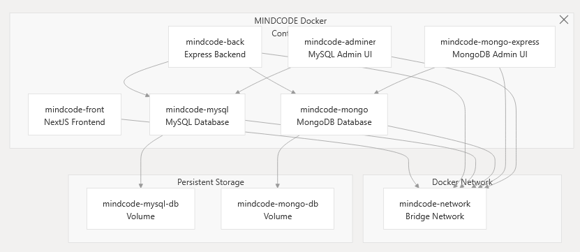
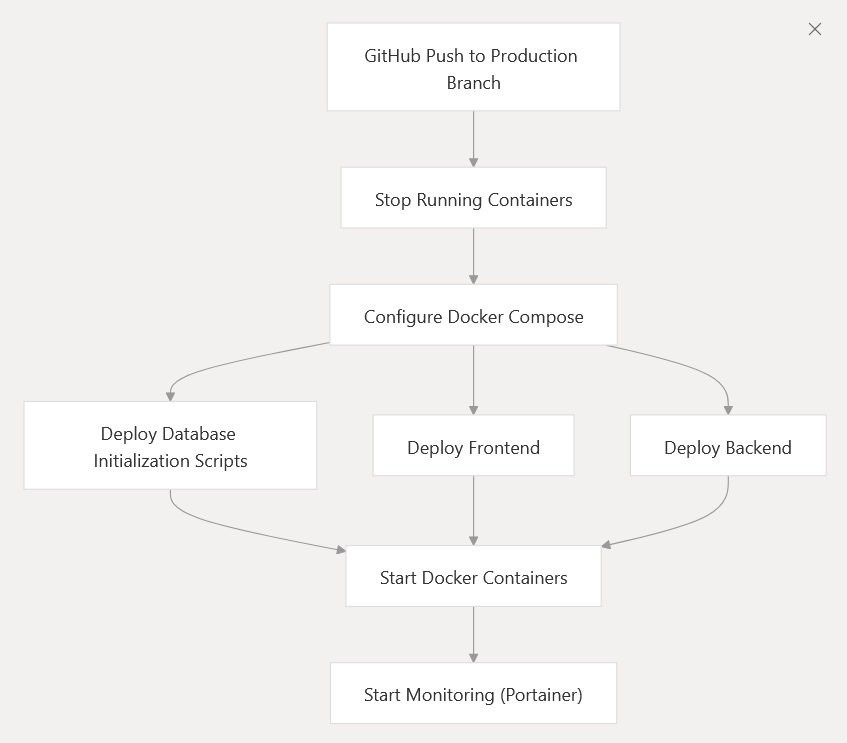
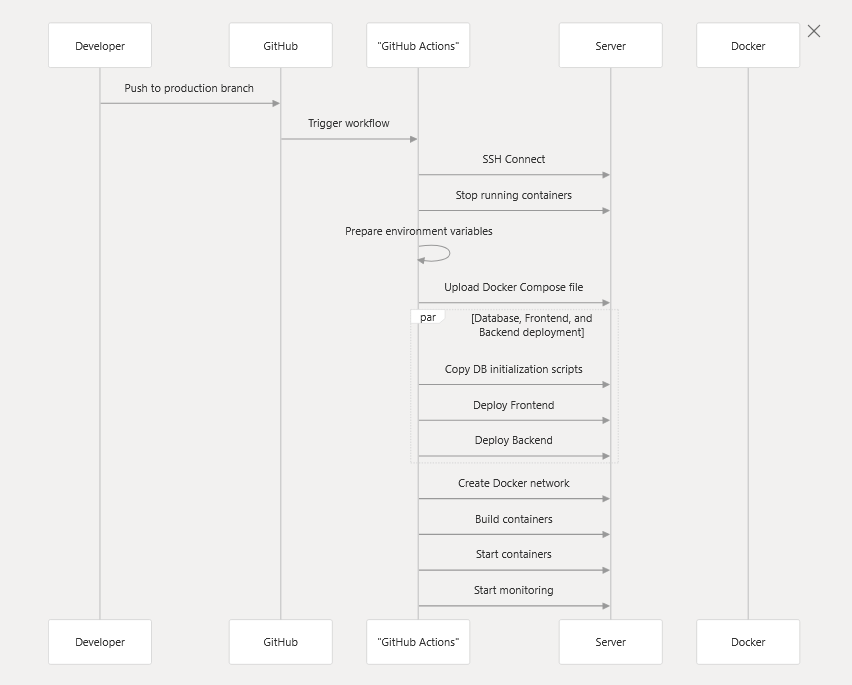

### INTEGRANTS :
  - Arnau Malaret
  - Inbisat Naveed
  - Bernat Mir
  - Kaetheen Guanoluisa
  - Arnau Fernández

### NOM DEL PROJECTE :
 MINDCODE
  
### DESCRIPCIÓ DEL PROJECTE :
  - Aquest projecte sorgeix de la necessitat de crear una eina capaç d'ajudar els alumnes amb els diferents llenguatges de programació utilitzats durant el curs. Mitjançant eines com IA i fonts d'informació, ajuden a resoldre els dubtes dels alumnes. La aplicació contindrà un filtre de classes i assignatures de manera que l'informació es filtri en funció del que l'alumne necessiti. També hi haurà una interfaç similar pels professors. On podràn controlar les assignatures i classes visibles pels alumnes, tenint la capacitat de modificar la visibilitat en funció de les necessitats (prova de validació, exercicis, temàtiques)


### GESTOR DE TASQUES : 
  - El gestor de tasques utilitzat serà Taiga, amb metodologia SCRUM, separat per sprints.
    [Taiga](https://www.example.com)

### PROTOTIP GRÀFIC :
  - Els prototips gràfics com els Mockups i Wireframes els realitzarem amb Penpot.
    URL Penpot: https://design.penpot.app/#/workspace/f5fe9278-89db-81e9-8004-fb0eecd41217/96c4bd8e-df43-800f-8005-9d499dc21428?page-id=96c4bd8e-df43-800f-8005-9d499dc21429

### URL DE PRODUCCIÓ : 
  - [Mindcode.cat](Mindcode.cat)

### ESTAT :
  Projecte en fase de documentació

### URL Diagrama entitat relació: https://app.diagrams.net/#G1TKbrb3gLTKSwPoLYVMBvoF4VPat1ewLT#%7B%22pageId%22%3A%22KMXDIqi0qLqnxIe9qrFn%22%7D

# Documentació

## Presentació resum

## Planificació

## Disseny

## CodiFont

## Documentacio tècnica

Carpeta [/doc](./doc)

## Presentació Funcional / Comercial 

## Demo

## Presentacio Tècnica 

## Manual Usuari

## Pitch

# Arquitectura de Desplegament

## Docker

Mindcode utilitza conterització per al desplegament, amb configuració diferents per a desenvolupament i producció. El sistema consisteix en múltiple serveis interconectats, incloent frontend, backend, bases de dades i eines d'administració.

Aquesta és l'arquitectura del docker:



El codi del docker de desenvolupament és [aquest](./compose.yaml)
I el codi del docker de producció és [aquest](./compose.production.yaml)

## Desplegament

A Mindcode tenim eines d'integració continua, concretament Github Actions, el qual puja a producció el projecte automàticament quan es llença el workflow. 

Els passos que fa són aquests:



O, vist de manera més concreta:



Aquesta manera de treballar ens aporta diferents millores de seguretat respecte no tenirles, com per exemple: 

1. Variables d'entorn es guarden com a Github secrets

2. Credencials de bases de dades es controlen des de variables d'entorn

3. La xarxa està aïllada amb l'us de la network de Docker

4. La conexió SSH està estrictament controlada per verificació per clau

## Com utilitzar

Requisits:

1. Docker instal·lat

2. Docker compose instal·lat

### Instal·lació

1. Clona el repositori

```sh
   git clone https://github.com/inspedralbes/prj-final-front-back-G5-mindcode.git
   ```
2. Aixeca el Stack

```sh
   docker compose up
   ```

### Desplegar

Requisits:

Els requisits mínims son un domini propi, docker instal·lat amb el plugin de docker compose, portainer instal·lat per a administració i un nginx amb un proxy invers amb aquesta configuració:

```
server {
    listen 80;
    listen [::]:80;

    server_name your_domain.com;

    location / {
        proxy_pass http://localhost:5173/;
        proxy_set_header Host $host;
        proxy_set_header X-Real-IP $remote_addr;
        proxy_set_header X-Forwarded-For $proxy_add_x_forwarded_for;
        proxy_set_header X-Forwarded-Proto $scheme;
    }

    location /back/ {
        proxy_pass http://localhost:3000/;
        proxy_set_header Host $host;
        proxy_set_header X-Real-IP $remote_addr;
        proxy_set_header X-Forwarded-For $proxy_add_x_forwarded_for;
        proxy_set_header X-Forwarded-Proto $scheme;
    }

    location /portainer/ {
        proxy_pass https://localhost:9443/;
        proxy_set_header Host $host;
        proxy_set_header X-Real-IP $remote_addr;
        proxy_set_header X-Forwarded-For $proxy_add_x_forwarded_for;
        proxy_set_header X-Forwarded-Proto $scheme;
    }
}
```

Un cop tens el nginx funcionant has de copiar el projecte a un altre repositori, ja que el deploy es fa mitjançant github actions, per a més informació sobre com fer-ho mira la [documentació oficial](https://docs.github.com/en/issues/planning-and-tracking-with-projects/creating-projects/copying-an-existing-project).

Un cop el tinguis copiathas d'afegir els secrets del repositori.

Per això:

1. Navega als settings

2. Baixa fins a secrets and variables

3. Clica-hi a actions i afegeix els secrets de repositori

Aquests són els secrets que s'han d'omplir

```
PROD_SECRET_KEY: Clau secreta del servidor host
PROD_USER: Nom de l'usuari del servidor
PROD_HOST: IP del servidor
MYSQL_USER: Nom d'usuari de la base de dades MySQL
MYSQL_PASSWORD: Contrasenya de la base de dades MySQL
MYSQL_ROOT_PASSWORD: Contrasenya root de la base de dades MySQL
MYSQL_HOST: ip de la base de dades MySQL
MYSQL_DATABASE: nom de la base de dades
MONGO_ROOT_USER: Nom de l'usuari root de la base de dades MongoDB
MONGO_ROOT_PASSWORD: Contrasenya de l'usuari root de la base de dades MongoDB
AI_HOST: IP de la ia 
BACK_PORT: 3000
PRODUCTION_API_URI: Adreça de crides al back
JWT_KEY: Clau per al JSON web token
```
Un cop els tinguis afegits només falta fer push a una branca que activi el workflow