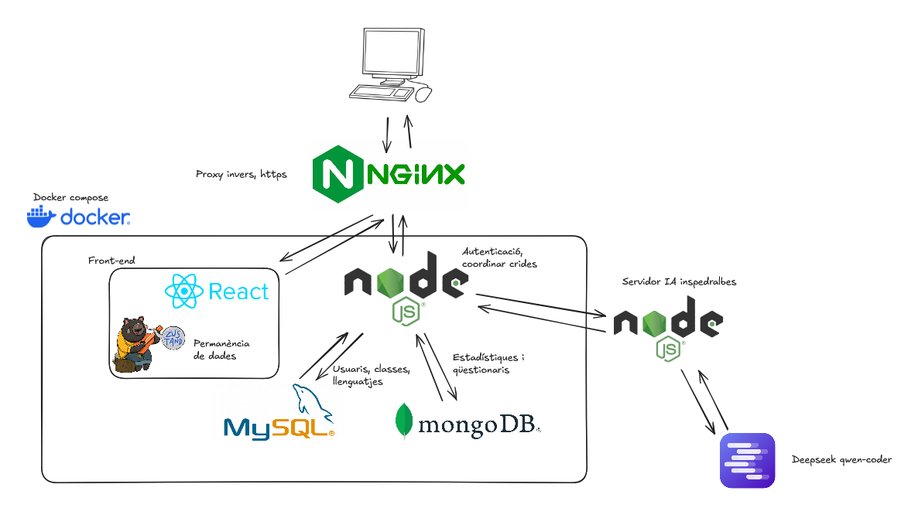

# Documentació tècnica

## Index

## Arquitectura de la aplicació

## Documentació API

Totes les rutes estan documentades al seu fitxer respectiu

- [API IA](../back/routes/aiRoutes.js)
- [API classes](../back/routes/classRoutes.js)
- [API google](../back/routes/googleRoutes.js)
- [API llenguatges](../back/routes/languageRoutes.js)
- [API restriccions](../back/routes/restrictionRoutes.js)
- [API estadístiques](../back/routes/statsRoutes.js)
- [API usuari](../back/routes/userRoutes.js)

> Tots els endpoints utilitzants, sumant els que parlen amb la IA es troben [aquí](./endpoints/)

## Esquema de les bases de dades

### MySQL

### MongoDB